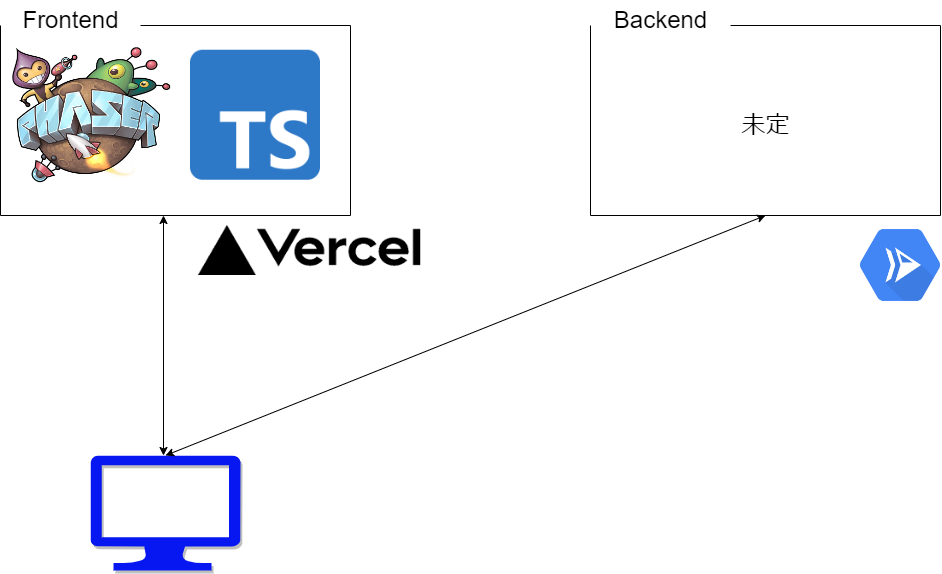

# teamdevD-devlog

## 成果物

完成次第，動画あるいは写真を掲載

## 概要
今回はカードゲームを作成することを目標とする．
ゲームの基本的な内容は
1. プレイヤーはカードが2枚配られる．
2. 手札の点数の合計が21枚を超えないように手札を決める．

**その他ルール**
- 手札の決め方
    - ヒット：山札から1枚引いて手札に加える．
    - スタンド：手札の確定させる．
    - バースト：手札の点数の合計が21を超えたら負けとする．
- カードの点数
    - 絵札：10点
    - Aから10まで：そこに書かれた数字の点数

- **LEVEL**
    - EASY LEVEL
        - CPU対戦はディーラーが相手とし，ディーラーよりも点数が高くなるようにする．

    - MEDIUM LEVEL
        - CPU対戦はAIプレイヤーが相手とし，かけたチップが最も高いプレイヤーが勝利する．
        - かけたチップが高いほど，出る数字に偏りが出やすい．

    -  HARD LEVEL
        - CPUのレベルがMEDIUM LEVELよりも高いものとする．

## 作るカードゲーム

- Blackjack

## 要件定義

- **目的**
    - ブラウザで動くゲームでカードゲームはブラックジャックとする．
        - 可能であれば，別のプラットフォームにも対応させる．
    - 最大４人でプレイ(まずは一人でプレイ用を開発を優先する．)
        - 他のカードゲームや掛け金制度などの拡張性を念頭に開発．

- **機能要件**
    - ゲーム
        - ゲームの選択ができる．(拡張性を考慮して)
        - プレイヤー名の入力ができる．
        - 手順
            1. プレイヤーはベットする金額を決める．(ベット金額は1，15，30)
            2. ディーラーからプレイヤーにカードが2枚ずつ配られる．
            3. ディーラーもカードを2枚所有し，1枚を公開する．(プレイヤーにも公開、非公開は流用できるように)
            4. プレイヤーが手札を決める．
                - ヒットの場合: デッキから1枚引いて手札に加える
                - スタンドの場合: 手札を確定を確定させる．
                - バーストの判定：点数を21点を超えた時点で負けとする．
            5. スタンドを選択する，あるいはバーストするまでdを繰り返す．
            6. d，eをプレイヤーごとに行う
            7. 全プレイヤーが5を終了後，ディーラは17以上になるまでカードを引く。
            8. ディーラーの手札を公開。点数がディーラーより大きいプレイヤーは勝利．(引き分けはプレイヤー負け)また，dでバーストしたプレイヤーは負けである．ディーラーが22を超えた際は，21を超えてないプレイヤーはすべて勝利とする．
            9. 最終的にベットした金額がもっとも高い人が勝利となる．金額が同じ場合は手札の点数が多い
            プレイヤーを勝利とする．

- **非機能要件**
    - UI/UXをより高いものとする．
    - OS・ブラウザ関係なく動作する．

## 技術要件
- フロントエンド
    - TypeScript + Phaser + Vite
- バックエンド
    - Node.js(デプロイのため)
- デプロイ環境
    - Vercel(GitHub pagesかも)

## アーキテクチャ関係
- <a href="https://github.com/teamdevD/teamdevD-devlog/blob/main/checklist/flowchart.md">フローチャート</a>
- <a href="https://github.com/teamdevD/teamdevD-devlog/blob/main/checklist/class-activity.md">クラスアクティビティ図</a>
- <a href="https://www.figma.com/file/mecx9liRG6UN2o9UmvnHZQ/CardGame?type=design&node-id=0%3A1&mode=design&t=GAjZQJPy6FAFSYPM-1">ワイヤーフレーム</a>

## 確認項目

- <a href="https://github.com/teamdevD/teamdevD-devlog/blob/main/checklist/github-tutorial.md">Git，Githubを使用した開発の流れ(Team D オリジナル)</a>

## マイルストーン(スケジュール)
以下を目標として開発を行う

**11/18**
Phaserの学習(勉強会)、要件定義、技術構成、ワイヤーフレーム、クラスアクティビティ．

**11/22**
GitHub，Gitの扱い方，issue，Trelloの扱い方のチュートリアル．

**11/25**
(FE)基本画面、(BE)基本的なクラスの作成(カード、プレイヤー)

**11/29**
開発ラストスパート

**12/9**
ブラックジャック自体の完成(あくまでカードゲームとして遊べるくらい。)

**12/23(最終)**
12/9時点の完成度によってTBD。他のゲームを作るか、拡張するか。

## 進捗

**11/11~11/18**
- 要件定義，非機能要件がほぼ決定
- 技術要件もほぼ決定
- フローチャート，アクティビティ図の大枠作成完了(作成しながら適宜修正)
- ワイヤーフレーム完了(こちらも適宜修正)
- Git, GitHubでの作業のチュートリアル完了
- 個人ではPhaser，Typescriptの学習

**11/19~**
- 本格的に作業に入る．
    - GitHubチュートリアルなどでブランチの切り方など共通認識を持ってできるからそこまで詰まらないはず・・・

## 議事録関係
### meeting-logに議事録を保存

- <a href="https://github.com/teamdevD/teamdevD-devlog/blob/main/meeting-log/231111-log.md">2023/11/11</a>
- <a href="https://github.com/teamdevD/teamdevD-devlog/blob/main/meeting-log/231115-log.md">2023/11/15</a>
- <a href="https://github.com/teamdevD/teamdevD-devlog/blob/main/meeting-log/231118-log.md">2023/11/18</a>
- <a href="https://github.com/teamdevD/teamdevD-devlog/blob/main/meeting-log/231126-log.md">2023/11/26</a>
