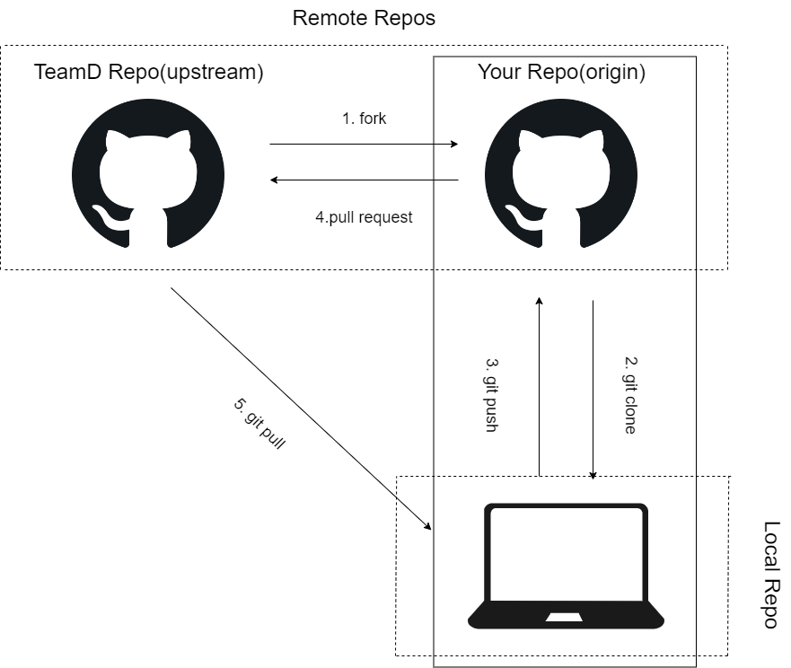

# Git，GitHubを使用した開発の流れ(Trello連携版)

## リモートリポジトリ，ローカルリポジトリの作成
1. GitHubでチームDのリポジトリを検索(URL：https://github.com/teamdevD/teamdevD-devlog)
2. 画面の右上の「fork」からforkする．
3. クローンする：`git clone https://github.com/[ユーザ名]/teamdevD-devlog.git`
4. クローンしたフォルダに移動：`cd [クローンしたフォルダ名]`
5. upstreamの登録：`git remote add upstream https://github.com/teamdevD/teamdevD-devlog.git`
6. `git remote -v`で以下のように出力されればOK
```
origin  https://github.com/[ユーザ名]/teamdevD-devlog.git (fetch)
origin  https://github.com/[ユーザ名]/teamdevD-devlog.git (push)
upstream        https://github.com/teamdevD/teamdevD-devlog.git (fetch)
upstream        https://github.com/teamdevD/teamdevD-devlog.git (push)
```

**注意：ここではdevlogリポジトリのリモートリポジトリ．ローカルリポジトリを作成している．開発ならworkspaceリポジトリに対して同様のことを行う．**
## 大まかなイメージ(ブランチはのちほど説明)



## Github IssueとTrelloの連携
<a href="https://github.com/teamdevD/teamdevD-devlog/blob/main/checklist/trello-howto.md">trello-howto.md</a>

## ブランチの切り方