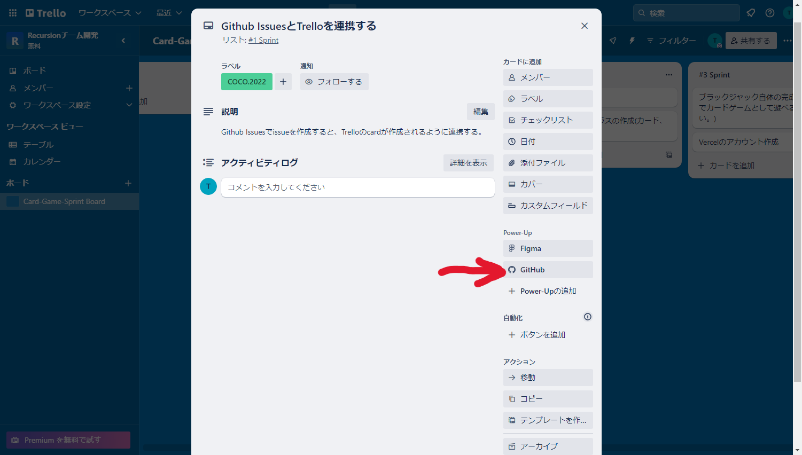

# チームDにおけるtrelloとgithubIssueの連携方法。

## 1. githubにissueを追加

## 2. trelloにissueと対応するタスクを追加。

## 3. Power-Upの部分にあるGitHubを選択

## 4. Issueの作成を選び、1で作ったissueを選択する。

*完成図*

## 参考リンク

https://support.atlassian.com/ja/trello/docs/using-the-github-power-up/